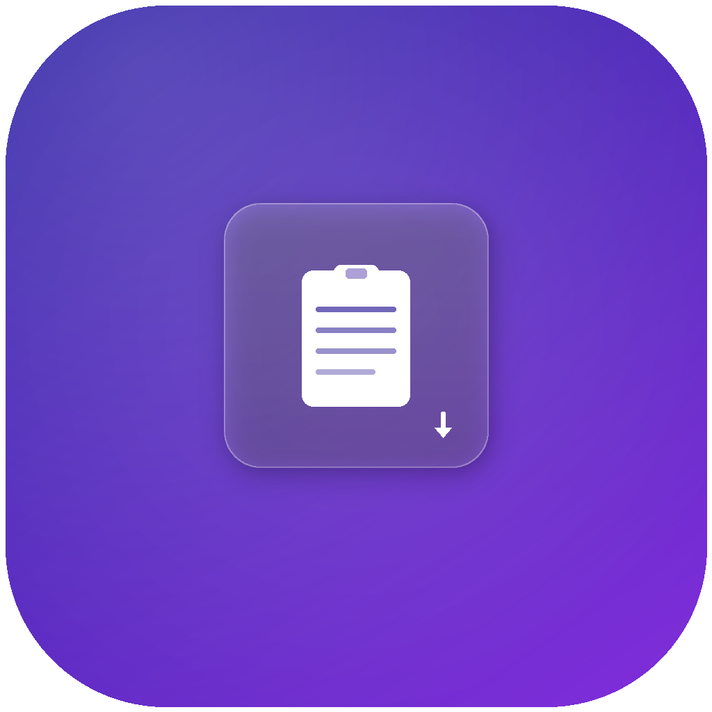

<p align="center">
  
</p>

<h1 align="center">PasteKey</h1>

<p align="center">
  A lightweight macOS menu bar app that lets you paste predefined text snippets instantly with custom hotkeys.
</p>

<p align="center">
  <a href="README_zh-Hans.md">简体中文</a> · <a href="README_zh-Hant.md">繁體中文</a> · <a href="README_ja.md">日本語</a>
</p>

<p align="center">
  
  
  
</p>

---

## Features

- **Instant paste** — Press a hotkey in any app, and your predefined text is pasted immediately
- **Custom hotkeys** — Assign any key combination (e.g. ⌘⇧1) to each snippet
- **Clipboard-safe** — Saves and restores your clipboard content after pasting
- **Menu bar app** — Lives quietly in your menu bar, no Dock icon
- **Launch at Login** — Optional auto-start when you log in

## Installation

### Build from Source

Requires macOS 13+ and Swift 5.9+.

```bash
git clone https://github.com/qiaoshouqing/pastekey.git
cd pastekey
swift build -c release
```

The built binary is at `.build/release/PasteKey`.

### Run Directly

```bash
swift run PasteKey
```

## Usage

1. Click the clipboard icon in the menu bar
2. Select **Settings...** to open the main window
3. Select a snippet from the sidebar (or click **+** to create one)
4. Enter the text you want to quick-paste
5. Click the hotkey recorder and press a key combination (e.g. ⌘⇧1)
6. Close the window — now press that hotkey in any app to paste your text

### Accessibility Permission

PasteKey needs Accessibility permission to simulate keyboard pasting. On first launch, macOS will prompt you to grant access in **System Settings > Privacy & Security > Accessibility**.

## How It Works

When you press a hotkey, PasteKey:

1. Saves your current clipboard
2. Puts the snippet text on the clipboard
3. Simulates ⌘V to paste
4. Restores your original clipboard

This means it works in virtually any app that supports paste.

## Tech Stack

- SwiftUI + AppKit
- [HotKey](https://github.com/soffes/HotKey) for global hotkey registration
- Swift Package Manager

## License

[MIT](LICENSE)
